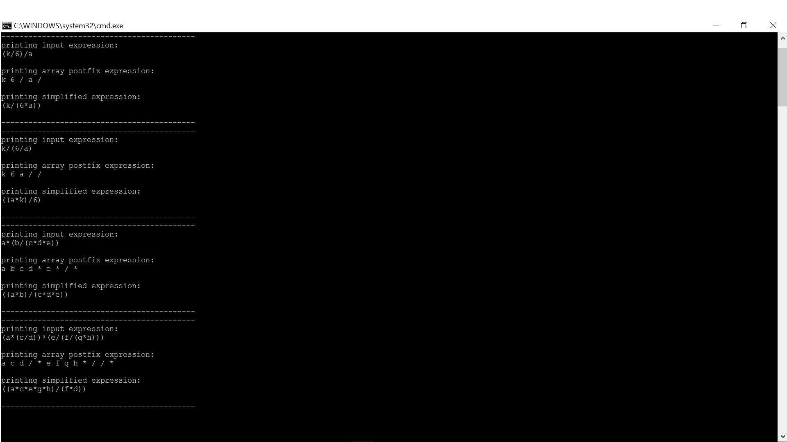

Algebraic simplification

This example is based on the very hastiliy implemented Genetic Programming Example
(soon to be updated). This code needs a tidy up. A lot of excess code has been removed,
including open GL dependencies that were left in there by accident.

Given an input expression like (a*(b/(c/d))) to simplifiy the code rewrites
to the form (a*b*d)/c. This is part of a reduction to canonical form, more details
are given here (and rather difficult implementations of the algorithms are in the code
of AST.h)

http://www.math.wpi.edu/IQP/BVCalcHist/calc5.html

Here is the example printout

</img>